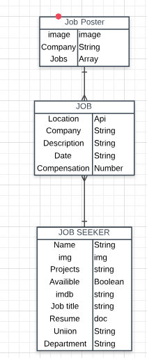
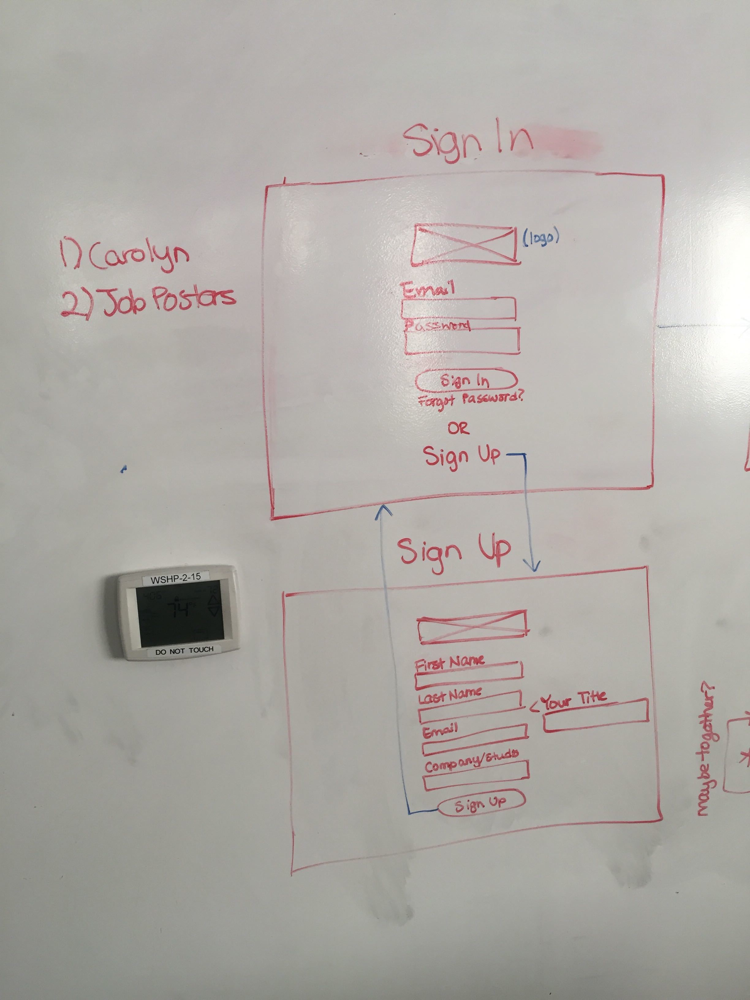
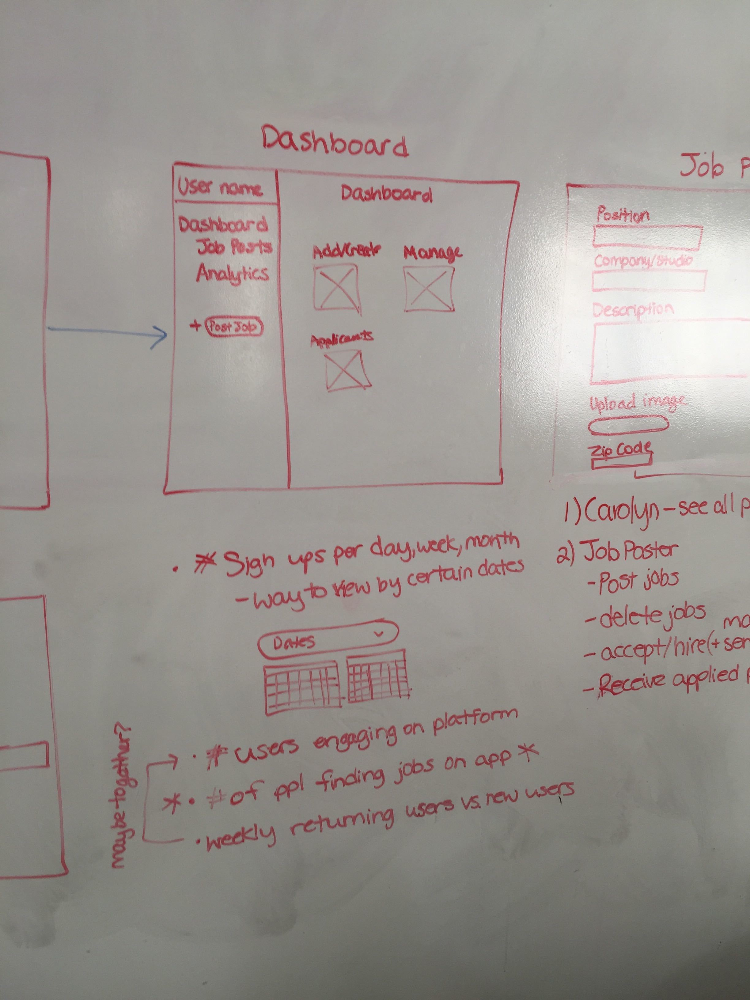
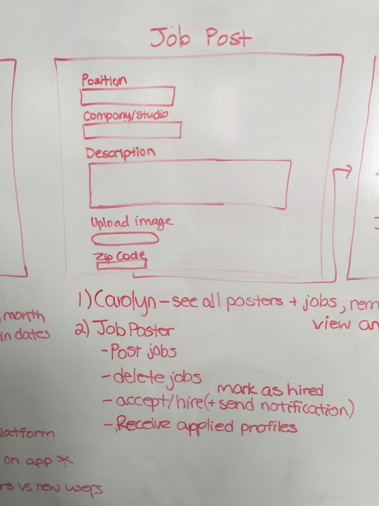

# Project4_Filmconnx

Filmconnx is a mobile and web solution to finding potenial hires, in Gerogias growing film industry.

# Data Structure

Our application uses three data models.

Job Poster

Job's

User

this is our structure.

Job poster and Users both have a many relationship with Jobs.

https://trello.com/b/pMrLPPFy/flimconxx

#MOBILE APP

https://www.figma.com/proto/PB1aF9gQ8aEwY0tCng3YV1Ig/FC-Brandy?node-id=443%3A2193&scaling=scale-down&redirected=1
